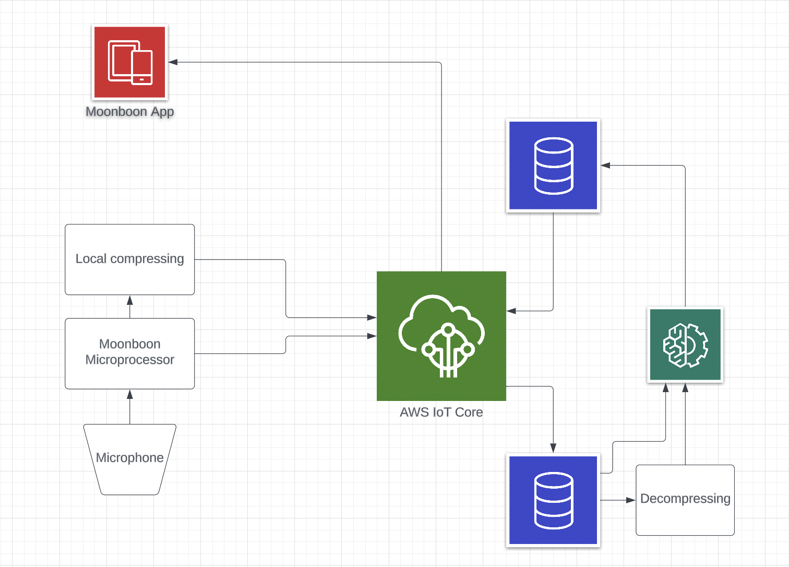

# Valhacks2024

Throughout this one-day hackathons, the following challenges was presented

1. Classification: Cyring, Breathing, Speaking adult, seaking baby, other, nothing
2. Breathing recognition: Breathing cadence breaths/minute, breathing variance (extra point for a human relatable unit)
3. Deep Classification: fam noices, env noics, speaking, babling, other

## Investigation:

The data avaliable were 33 gbs of soundfiles with a small portion being labelled. We investigated and quickly found the labelled parts to be wrong or of poor quality, hence we decided to find other ways to properly partition and classify the data.

This makes the challenge much more difficult. We had to focus on much less extensive classification. The most important for end-users (parents) are probably weather the kid is breathing (how that breathing is) or crying, so we decided to hone in on those categories.

We develop an minimalistic cloud architecture to help us focus our efforts even more. The ML algorithms for doing the classification above would most likely be too much to for local machines, so this would be done on the web. Sending audiosignals to the web could become extensive (although we thought it would be okay), we developed an autoencoder to compress and decompress the data effectively (here it should be noted another team presented a pretrained model for this task, which would work way better than our approach).

A rather simple function using traditional audio signal analyzing methods to figure out the breath rhythm. This worked quite well, and some simple logic helped us transfer variance to a easy to understand human metric.

It should be noted that these methods were only slightly tested manually. More extensive testing is needed to tune this methods even more and to get true evaluation metrics. 

## Code:

There is a bunch of random files here, but essentially this is the important parts:

- tester.ipynb: Our approach to classification using K-means and KNN
- Lucas/autoencoder.ipynb: Training of the autoencoder
- Lucas/breathing_cadence.ipynb: Breathing cadence analyzing

All other files are essentially tests that did not go well. They don't make a lot of sense. The notebook can be hard to understand, so reach out to me, if anything needs clarification.

Some notes on the autoencoder:
- Really lightweight: 11kb
- Built for extremely lightweight optimization
- Only downside is that it has to be deployed in Python which puts restrictions on MCUs
- 13x less data has to be sent over cloud